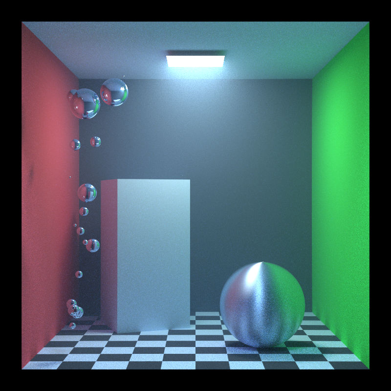
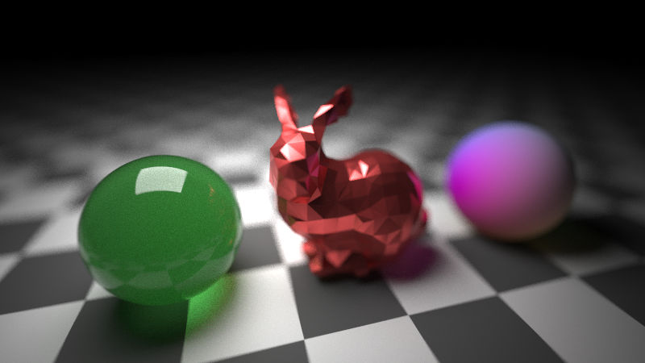

# capcell

Capcell is a cpu-pathtracer written in Rust

## Features

- Unidirectional pathtracing
- Next event estimation
- BSDFs
  + Ideal diffuse and specular
  + Microfacet BRDF/BTDF
  + UE4-like BRDF
- Homogeneous medium
- Hero wavelength sampling

## Dependencies

- bmp: https://github.com/sondrele/rust-bmp
- rayon: https://github.com/rayon-rs/rayon
- hdrldr: https://github.com/TechPriest/hdrldr
- tobj: https://github.com/Twinklebear/tobj

## Usage

```sh
git clone git@github.com:Goomasa/capcell.git
cd capcell

cargo run --release
```

## Gallery





Stanford bunny: 

> © Copyright Stanford University – Computer Graphics Laboratory

> [https://graphics.stanford.edu/data/3Dscanrep/](http://graphics.stanford.edu/data/3Dscanrep/)

## References

- Brian Karis, Epic Games, Real Shading in Unreal Engine 4, 2013
- Eric Heitz, Unity Technologies, Sampling the GGX Distribution of Visible Normals, Journal of Computer Graphics Techniques
, 2018, Vol. 7, No. 4
- A. Wilkie, et al. Hero Wavelength Spectral Sampling, Computer Graphics Forum, 2014, Vol. 33, No.4,
- https://blog.teastat.uk/post/2021/12/montecarlo-raytracing-of-colored-volume/
- https://rayspace.xyz/CG/